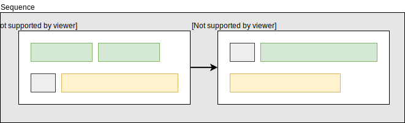
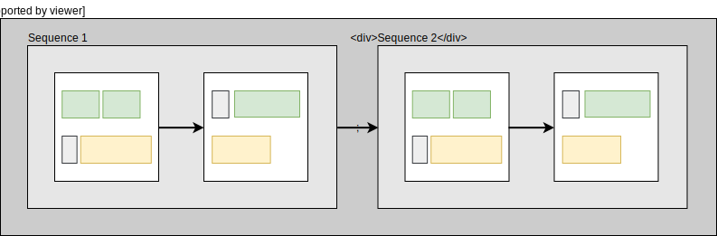

## About Me

- Live in Malmö, Sweden
- Work for [Symbiont](https://symbiont.io/)
- Blog at [wickstrom.tech](https://wickstrom.tech)
- Maintain some open source projects
- [Haskell at Work](https://haskell-at-work.com) screencasts
- Spent the last year writing a screencast video editor

# Introduction

## Property-based testing

* Testing _properties_ of your system
* Large set of inputs
* Static and dynamic languages
	* QuickCheck
	* Hypothesis
	* test.check
	* Hedgehog

## Simple Examples

* List reverse

    ```haskell
    prop_reverse xs =
      reverse(reverse xs) == xs
    ```
* Natural number arithmetic

	```haskell
	prop_commutative x y =
	  x + y == y + x
	```
* Sorting algorithms

	```haskell
	prop_sort xs =
	  mySuperSort xs == industryStandardSort xs
	```

## Hedgehog

* Random generated inputs
* Integrated shrinking
* Great error reporting
* Concurrent test execution
* Not using type classes(!)

## List Reverse with Hedgehog

```{.haskell include=src/examples/Examples.hs snippet=reverse}
```

## List Sort with Hedgehog

```{.haskell include=src/examples/Examples.hs snippet=sort}
```

## Failures


## Rhetorical Question

How many of you write sort algorithms in your day job?

## How do I use this in my job?

* What if you're working with:
  * Backends with databases and integrations?
  * Frontends with GUIs and user input?
  * Data pipelines and analytics?
* Hard to write properties
* Fewer examples

# Property-Based Testing for the Busy Programmer{.dark background=images/dog.jpg}

## Testing the "Ugly" Parts

* Not everything will be small pure functions
* Complex interactions between larger modules
* Non-determinism
  - Statefulness
  - Side-effects

## Designing for Testability

* Regular "writing testable code" guidelines apply:
  - Single responsibility
  - Determinism (not necessarily pure!)
* Rich data types
* Low coupling between interface and implementation

## State Machine Testing

...

## Patterns for Properties

- ["Choosing properties for property-based testing"](https://fsharpforfunandprofit.com/posts/property-based-testing-2/) by Scott Wlaschin
  - "Different paths, same destination"
  - "There and back again"
  - "Some things never change"
  - "The more things change, the more they stay the same"
  - "Solve a smaller problem first"
  - "Hard to prove, easy to verify"
  - "The test oracle"


# Case Studies from Komposition{.dark background=images/komposition-bg.png}

## Komposition


<table>
  <tr>
    <td>
- Cross-platform GUI application
- Modal
- Hierarchical timeline
    - Sequences
    - Parallels
    - Tracks
    - Clips and gaps
- Automatic scene classification
- Automatic sentence classification
- Keyboard-driven editing workflow
    </td>
    <td width="50%">

    </td>
  </tr>
</table>

## Complex Features

* Most complex features in Komposition
  - Focus and timeline transformations
  - Video classification
  - Rendering
  - Application logic
* Spend effort on testing those

## Case Studies

1. Timeline Flattening
2. Video Scene Classification
3. Focus and Timeline Consistency
4. Undo/Redo Symmetricity

# Hierarchical Timeline{background=#dddddd}

## Clips

{width=80%}

<aside class="notes">
- Clips are put in video and audio tracks within parallels
- Tracks are played in parallel, hence the name
</aside>

## Video Still Frames

{width=80%}

<aside class="notes">
If the video track is shorter, it will be padded with still frames
</aside>

## Adding Gaps

{width=100%}

<aside class="notes">
- You can add explicit gaps in video and audio tracks
- These are also filled with still frames for video
</aside>

## Sequences

{width=100%}

<aside class="notes">
- Parallels are put in sequences
- Each parallel is played until its end, then the next, and so on
- Multiple parallels can be used to synchronize clips
</aside>

## Timeline

{width=100%}

<aside class="notes">
- The top level is the timeline
- The timeline contain sequences
- It's useful for organizing the parts of your screencast
</aside>

# <strong>Case Study 1:</strong> Timeline Flattening

## Timeline Flattening

* Timeline is hierarchical
  - Sequences
  - Parallels
  - Tracks
  - Clips and gaps
* FFmpeg render knows only about two flat tracks
  - Video track
  - Audio track
  
## Timeline Flattening (Graphical)

{width=100%}

## Testing Duration

```{.haskell emphasize=5:5-5:99}
hprop_flat_timeline_has_same_duration_as_hierarchical =
  property $ do
    t <- forAll $ Gen.timeline (Range.exponential 0 20) Gen.parallelWithClips
    let Just flat = Render.flattenTimeline t
    durationOf AdjustedDuration t === durationOf AdjustedDuration flat
````

## Testing Clip Occurence

```{.haskell emphasize=5:5-5:99,6:5-6:99}
hprop_flat_timeline_has_same_clips_as_hierarchical =
  property $ do
    t <- forAll $ Gen.timeline (Range.exponential 0 20) Gen.parallelWithClips
    let Just flat = Render.flattenTimeline t
    timelineVideoClips t === flatVideoClips flat
    timelineAudioClips t === flatAudioClips flat
```

## Further Improvements

* Missing properties
  - How are video gaps padded with still frames?
  - Same flat result regardless of grouping (split/join sequences, then flatten)
* Padding with frames from other parallels
  - Frames are only picked from video clips within the parallel
  - Should pick from _any_ video clip within the timeline
  - Write properties to guide the refactoring

# <strong>Case Study 2:</strong> Video Scene Classification

## Video Scene Classification

* Komposition can automatically classify "scenes"
  * **Moving segment:** _M_ consecutive non-equal frames
  * **Still segment:** _S_ consecutive near-equal frames
* _M_ and _S_ are preconfigured thresholds of moving and
  still segment durations
  
## Visualizing with Color Tinting


## Testing Video Classification

TODO: ...

# <strong>Case Study 3:</strong> Focus and Timeline Consistency

# <strong>Case Study 4:</strong> Undo/Redo Symmetricity

# Summary

## Summary

## References

https://fsharpforfunandprofit.com/posts/property-based-testing-2/
  
## Questions?


## Thank You!

- Komposition: [owickstrom.github.io/komposition/](https://owickstrom.github.io/komposition/)
- Slides: [owickstrom.github.io/property-based-testing-the-ugly-parts/](https://owickstrom.github.io/property-based-testing-the-ugly-parts/)
- Image credits:
  - ...
- Thanks to [\@rjmh](https://twitter.com/rjmh) for great feedback!
