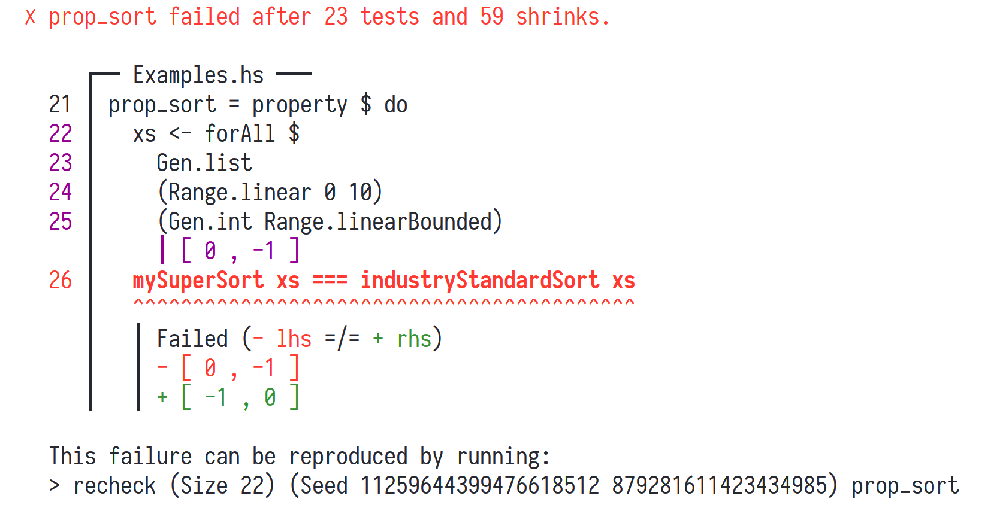
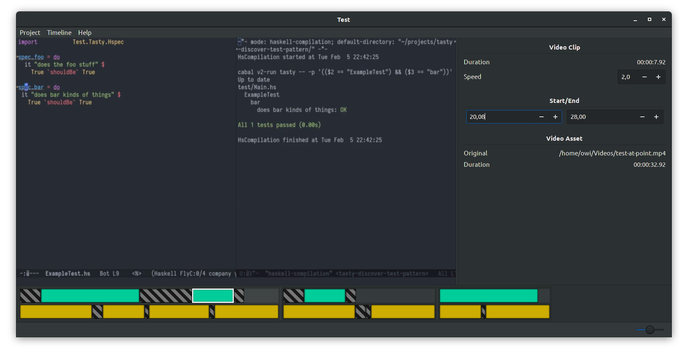
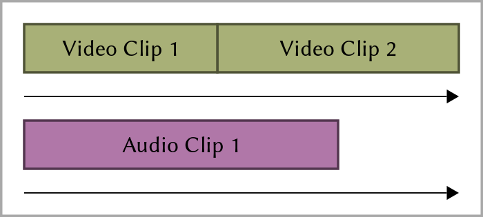
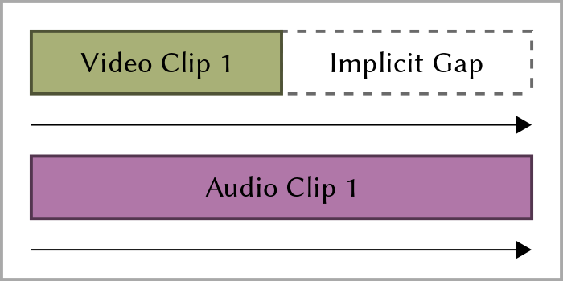
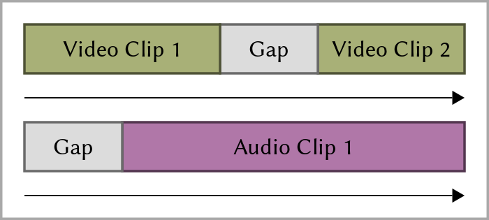
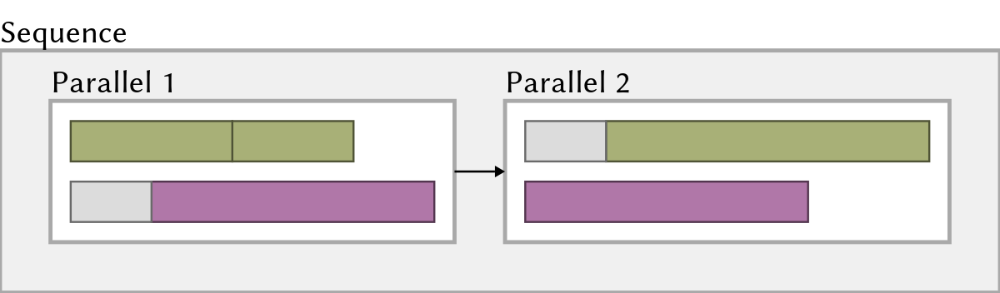
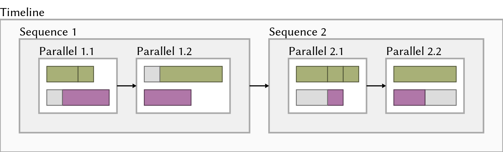
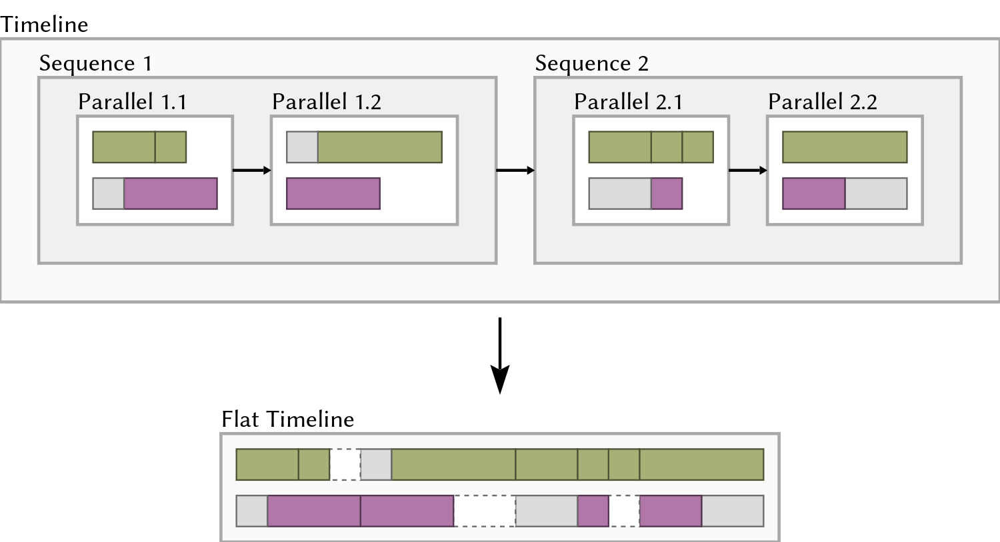
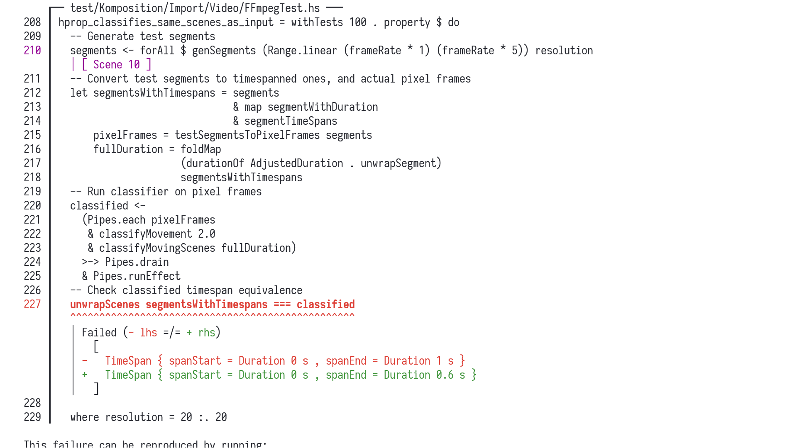

## About Me

- Live in Malmö, Sweden
- Work for [Symbiont](https://symbiont.io/)
- Blog at [wickstrom.tech](https://wickstrom.tech)
- Maintain some open source projects
- [Haskell at Work](https://haskell-at-work.com) screencasts
- Spent the last year writing a screencast video editor called _Komposition_

## Agenda

* Introduction to Hedgehog
* Property-Based Testing for the Industry Programmer
* Case Studies from Komposition

# Introduction to Hedgehog

## Hedgehog

* Random generated inputs
* Integrated shrinking
* Great error reporting
* Concurrent test execution
* Generators as values
    - Unlike `Arbitrary` in QuickCheck

## List Reverse with Hedgehog

```{.haskell include=src/examples/Examples.hs snippet=reverse}
```

## List Sort with Hedgehog

```{.haskell include=src/examples/Examples.hs snippet=sort}
```

## Failures



## Poll

How many of you write sort algorithms in your day job?

## How do I use this in my job?

* What if you're working with:
  * Backends with databases and integrations?
  * Frontends with GUIs and user input?
  * Data pipelines and analytics?
* Hard to write properties
* Fewer examples

# Property-Based Testing for the Industry Programmer{.dark background=images/dog.jpg}

## Testing the "Ugly" Parts

* Not everything will be small pure functions
* Complex interactions between larger modules
* Stateful
* Side-effects

## Designing for Testability

* Regular "writing testable code" guidelines apply:
  - Single responsibility
  - Determinism
  - No global side-effects
  - Low coupling between interface and implementation

## Patterns for Properties

- ["Choosing properties for property-based testing"](https://fsharpforfunandprofit.com/posts/property-based-testing-2/) by Scott Wlaschin
  - "Different paths, same destination"
  - "There and back again"
  - "Some things never change"
  - "The more things change, the more they stay the same"
  - "Solve a smaller problem first"
  - "Hard to prove, easy to verify"
  - "The test oracle"
- Study others' property tests
- Practice!

## Other Interesting Techniques

* State-machine testing
* "Database of inputs"
  - [Testing Our Ruby and Haskell Implementations Side-By-Side](https://blog.mpowered.team/posts/2018-testing-ruby-haskell-implementations.html)

# Case Studies from Komposition{.dark background=images/komposition-bg.png}

## Komposition

<table>
  <tr>
    <td>
- Desktop GUI application
- Modal
- Hierarchical timeline
    - Sequences
    - Parallels
    - Tracks
    - Clips and gaps
- Automatic scene classification
- Automatic sentence classification
- Keyboard-driven editing workflow
    </td>
    <td width="50%">

    </td>
  </tr>
</table>

## Complex Features

* Most complex features in Komposition
  - Focus and timeline transformations
  - Video classification
  - Rendering
  - Application logic
* Spend effort on testing those

## Case Studies

1. Timeline Flattening
2. Video Scene Classification
3. Focus and Timeline Consistency
4. Undo/Redo Symmetry

# Hierarchical Timeline{background=#dddddd}

## Clips

{width=700}

<aside class="notes">
- Clips are put in video and audio tracks within parallels
- Tracks are played in parallel, hence the name
</aside>

## Video Still Frames

{width=700}

<aside class="notes">
If the video track is shorter, it will be padded with still frames
</aside>

## Adding Gaps

{width=700}

<aside class="notes">
- You can add explicit gaps in video and audio tracks
- These are also filled with still frames for video
</aside>

## Sequences

{width=1200}

<aside class="notes">
- Parallels are put in sequences
- Each parallel is played until its end, then the next, and so on
- Multiple parallels can be used to synchronize clips
</aside>

## Timeline

{width=1500}

<aside class="notes">
- The top level is the timeline
- The timeline contain sequences
- It's useful for organizing the parts of your screencast
</aside>

# <strong>Case Study 1:</strong> Timeline Flattening

## Timeline Flattening

* Timeline is hierarchical
  - Sequences
  - Parallels
  - Tracks
  - Clips and gaps
* FFmpeg render knows only about two flat tracks
  - Video track
  - Audio track

## Timeline Flattening (Graphical)

{width=100%}

## Testing Duration

```{.haskell emphasize=5:5-5:99}
hprop_flat_timeline_has_same_duration_as_hierarchical =
  property $ do
    t <- forAll $ Gen.timeline (Range.exponential 0 20) Gen.parallelWithClips
    let Just flat = Render.flattenTimeline t
    durationOf AdjustedDuration t === durationOf AdjustedDuration flat
````

## Testing Clip Occurence

```{.haskell emphasize=5:5-5:99,6:5-6:99}
hprop_flat_timeline_has_same_clips_as_hierarchical =
  property $ do
    t <- forAll $ Gen.timeline (Range.exponential 0 20) Gen.parallelWithClips
    let Just flat = Render.flattenTimeline t
    timelineVideoClips t === flatVideoClips flat
    timelineAudioClips t === flatAudioClips flat
```

## More on Timeline Flattening

* Other properties
  - How video gaps are padded with still frames
  - Same flat result regardless of grouping (split/join sequences, then flatten)
* Padding with frames from other parallels
  - Frames are only picked from video clips within the parallel
  - Should pick from _any_ video clip within the timeline
  - Write properties to guide my work

# <strong>Case Study 2:</strong> Video Scene Classification

## Video Scene Classification

* Komposition can automatically classify "scenes"
  * **Moving segment:** consecutive non-equal frames
  * **Still segment:** at least _S_ seconds of consecutive near-equal
    frames
* _S_ is a preconfigured threshold for still segment duration
* Edge cases:
  - First segment is always a moving segment
  - Last segment may be shorter

## Visualizing with Color Tinting


## Testing Video Classification

* Generate high-level representation of _expected_ output segments
* Convert output representation to actual pixel frames
  - Moving frames: flipping between grey and white pixels
  - Still frames: all black pixels
* Run the classifier on the pixel frames
* Test properties based on:
  - the expected output representation
  - the actual classified output

## Two Properties of Video Classification

1. Classified still segments must be at least _S_ seconds long
   - Ignoring the last segment (which may be a shorter still segment)
2. Classified moving segments must have correct timespans
   - Comparing the generated _expected_ output to the classified
     timespans
   - (here were bugs!)

## Testing Still Segment Lengths

```{.haskell}
hprop_classifies_still_segments_of_min_length = property $ do

  -- Generate test segments
  segments <- forAll $
    genSegments (Range.linear 1 (frameRate * 2)) resolution

  -- Convert test segments to actual pixel frames
  let pixelFrames = testSegmentsToPixelFrames segments

  ...
```

## Testing Still Segment Lengths (cont.)

```{.haskell}
  ...

  -- Run classifier on pixel frames
  let counted = classifyMovement 1.0 (Pipes.each pixelFrames)
                & Pipes.toList
                & countSegments

  -- Sanity check: same number of frames
  countTestSegmentFrames segments === totalClassifiedFrames counted

  -- Then ignore last segment (which can be a shorter still segment),
  -- and verify all other segments
  case initMay counted of
    Just rest -> traverse_ (assertStillLengthAtLeast 1.0) rest
    Nothing     -> success
  where
    resolution = 10 :. 10
```

## Success!

```{.text}
> Hedgehog.check hprop_classifies_still_segments_of_min_length
  ✓ <interactive> passed 100 tests.
```

## Testing Moving Segment Timespans

```{.haskell}
hprop_classifies_same_scenes_as_input = property $ do

  -- Generate test segments
  segments <- forAll
    genSegments (Range.linear (frameRate * 1) (frameRate * 5)) resolution

  -- Convert test segments to timespanned ones, and actual pixel frames
  let segmentsWithTimespans = segments
                              & map segmentWithDuration
                              & segmentTimeSpans
      pixelFrames = testSegmentsToPixelFrames segments
      fullDuration = foldMap
                     (durationOf AdjustedDuration . unwrapSegment)
                     segmentsWithTimespans

  ...
```

## Testing Moving Segment Timespans (cont.)

```{.haskell}
  ...

  -- Run classifier on pixel frames
  classified <-
    (Pipes.each pixelFrames
     & classifyMovement 1.0
     & classifyMovingScenes fullDuration)
    >-> Pipes.drain
    & Pipes.runEffect

  -- Check classified timespan equivalence
  unwrapScenes segmentsWithTimespans === classified

  where resolution = 10 :. 10
```

## Failure!



## What Went Wrong?

* There were multiple bugs:
    - The specificiation was wrong
    - The generators and tests had errors
    - The implementation had errors (since its inception)
* Process:
  - Think about the specification first
  - Think about how generators and tests should work, rewrite them
  - Get minimal examples of failures, fix the implementation
* Thousands of tests ran successfully
* Tried importing actual recorded video, had great results!

# <strong>Case Study 3:</strong> Focus and Timeline Consistency

## Focus and Timeline

* The _focus_ is a data structure that "points" to a part of the
  timeline
* The timeline and focus must at all points be consistent
* User commands can:
  - alter the timeline
  - alter the focus
* Undo/redo complicates things

## Testing Focus and Timeline Consistency

* Generate a random initial state
* Generate a random sequence of user commands
* Run all commands until termination
    - main control flow
      - entering/exiting modes
    - state
    - event handling (stubbed)
    - effects (stubbed)
* Assert that the focus and timeline are consistent
  - Checking that "get the focused part" returns something

## Focus and Timeline Property Test


```{.haskell}
hprop_focus_never_goes_invalid = property $ do

  -- Generate the initial timeline and focus
  timelineAndFocus <- forAllWith
    showTimelineAndFocus
    (Gen.timelineWithFocus (Range.linear 0 10) Gen.parallel)

  -- And from those, the initial timeline mode state
  initialState <- forAll (initializeState timelineAndFocus)

  -- Generate a sequence of events (user commands)
  events <- forAll $
    Gen.list (Range.exponential 1 500) genFocusChangingEvents

  ...
```

## Focus and Timeline Property Test (cont.)


```{.haskell}
  ...

  -- Run all the user commands (wrapped in events)
  endState <- runTimelineStubbedWithExit (concat events) initialState

  -- Check that the focus points to something in the timeline
  assert . isJust $ atFocus
    (endState ^. existingProject.project.timelineFocus)
    (endState ^. existingProject.project.timeline.UndoRedo.current)
```

# <strong>Case Study 4:</strong> Undo/Redo Symmetry

## Undo/Redo Symmetry

* Undo/Redo was previously implemented as stacks of previous/future
  states
* Consumed gigabytes of disk space and RAM for projects with many
  edits
* Rewrote the implementation to only store "invertible actions"

## Testing Undo

* Generate an initial state
* Generate a sequence of undoable commands
* Run all commands
* Run undo command for each original command
* Assert that we end up at the initial state

## Actions are Undoable

```{.haskell}
hprop_undo_actions_are_undoable = property $ do

  -- Generate initial timeline and focus
  timelineAndFocus <- forAllWith showTimelineAndFocus $
    Gen.timelineWithFocus (Range.linear 0 10) Gen.parallel

  -- Generate initial application state
  initialState <- forAll (initializeState timelineAndFocus)

  -- Generate a sequence of undoable/redoable commands
  events <- forAll $
    Gen.list (Range.exponential 1 100) genUndoableTimelineEvent

  ...
```

## Actions are Undoable (cont.)

```{.haskell}
  ...

  -- We begin by running 'events' on the original state
  beforeUndos <- runTimelineStubbedWithExit events initialState

  -- Then we run as many undo commands as undoable commands
  afterUndos <- runTimelineStubbedWithExit (undoEvent <$ events) beforeUndos

  -- That should result in a timeline equal to the one we at the
  -- beginning
  timelineToTree (initialState ^. currentTimeline)
    === timelineToTree (afterUndos ^. currentTimeline)
```

## Testing Redo

* Generate an initial state
* Generate a sequence of undoable/redoable commands
* Run all commands
* Run undo _and redo_ commands for each original command
* Assert that we end up at the state before running undos

## Actions are Redoable

```{.haskell}
hprop_undo_actions_are_redoable = property $ do

  -- Generate the initial timeline and focus
  timelineAndFocus <- forAllWith showTimelineAndFocus $
    Gen.timelineWithFocus (Range.linear 0 10) Gen.parallel

  -- Generate the initial application state
  initialState <- forAll (initializeState timelineAndFocus)

  -- Generate a sequence of undoable/redoable commands
  events <- forAll $
    Gen.list (Range.exponential 1 100) genUndoableTimelineEvent
```

## Actions are Redoable (cont.)

```{.haskell}
  -- We begin by running 'events' on the original state
  beforeUndos <- runTimelineStubbedWithExit events initialState

  -- Then we undo and redo all of them
  afterRedos  <-
    runTimelineStubbedWithExit (undoEvent <$ events) beforeUndos
    >>= runTimelineStubbedWithExit (redoEvent <$ events)

  -- That should result in a timeline equal to the one we had before
  -- starting the undos
  timelineToTree (beforeUndos ^. currentTimeline)
    === timelineToTree (afterRedos ^. currentTimeline)
```


## Undo/Redo Test Summary

* These tests made the refactoring possible
* Founds _many_ interim bugs
  - Off-by-one index
  - Inconsistent focus
  - Non-invertible actions
* After the tests passed: ran the GUI, it worked

# Wrapping Up

## Summary

* Property-based testing is not only for pure functions!
  - Effectful actions
  - Integration tests
* Using them in Komposition:
  - Made refactoring and evolving large parts of the system tractable
    and much more safe
  - Found existing errors in my thinking, my tests, my implementation
  - It's been a joy

## References

* [What is Property Based Testing?](https://hypothesis.works/articles/what-is-property-based-testing/) by David R. MacIver
* [Experiences with QuickCheck: Testing the Hard Stuff and Staying Sane](https://www.cs.tufts.edu/~nr/cs257/archive/john-hughes/quviq-testing.pdf) by John Hughes
* ["Choosing properties for property-based testing"](https://fsharpforfunandprofit.com/posts/property-based-testing-2/) by Scott Wlaschin

## Thank You!

- "Property-Based Testing in a Screencast Editor" series:
  - [Introduction](https://wickstrom.tech/programming/2019/03/02/property-based-testing-in-a-screencast-editor-introduction.html)
  - [Timeline Flattening](https://wickstrom.tech/programming/2019/03/24/property-based-testing-in-a-screencast-editor-case-study-1.html)
- Komposition: [owickstrom.github.io/komposition/](https://owickstrom.github.io/komposition/)
- Slides: [owickstrom.github.io/property-based-testing-the-ugly-parts/](https://owickstrom.github.io/property-based-testing-the-ugly-parts/)
- Thanks to [John Hughes](https://twitter.com/rjmh) for feedback
- Image credits:
  - [I Have No Idea What I'm Doing](https://knowyourmeme.com/photos/234765-i-have-no-idea-what-im-doing)
